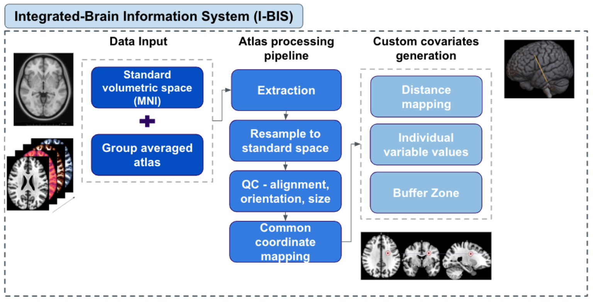

# IBIS

**IBIS** (Integrated Brain Information System) is a modular neuroimaging pipeline for extracting and consolidating brain imaging covariates (ROI voxels, buffer zones, EDT, variance) from NIfTI data. Designed for use in prediction and machine-learning workflows.

## Overview

The pipeline provides four main steps:

1. **ROI extraction** — Voxel coordinates and intensity values from ROI masks (NIfTI or CSV).
2. **Buffer zone analysis** — Spherical seed-based metrics around coordinates.
3. **Variable extraction** — EDT (Euclidean Distance Transform) and variance from masked regions.
4. **Data consolidation** — Merge covariate outputs into unified CSV tables.

### Pipeline workflow

The following diagram illustrates the basic workflow and data flow between steps:



## Directory structure

```
IBIS/
├── config/
│   ├── pipeline_config.yaml   # Main paths and step options
│   ├── roi_config.yaml        # ROI and mask settings
│   └── buffer_zone_config.yaml # Buffer zone radii and options
├── scripts/
│   ├── roi_extraction.py
│   ├── buffer_zone.py
│   ├── variable_extraction.py
│   ├── data_consolidation.py
│   └── utils.py
├── input/                     # Your data (see Input structure below)
│   ├── coordinates/          # CSV with X,Y,Z (optional)
│   ├── images/               # NIfTI brain images
│   ├── masks/                # ROI masks
│   ├── QNP_vox_coords/       # Pre-extracted voxel coordinates (optional)
│   ├── 4_edt_m/ or EDT/      # EDT images (optional)
│   └── Var/                  # Variance images (optional)
├── output/
│   ├── roi/
│   ├── buffer_zone/
│   ├── variables/            # edt/ and var/ subdirs
│   ├── consolidated/
│   └── logs/
├── run_ibis_pipeline.py      # Main entry point
├── check_setup.py
├── test_pipeline.py
├── requirements.txt
└── README.md
```

## Installation

### Prerequisites

- **Python 3.7+**
- **Neuroimaging data** in NIfTI (`.nii` or `.nii.gz`)

### Setup

1. Clone or copy the repository and go to its root:
   ```bash
   cd IBIS
   ```

2. Install dependencies:
   ```bash
   pip install -r requirements.txt
   ```

3. Verify setup:
   ```bash
   python check_setup.py
   ```

4. (Optional) Install in development mode:
   ```bash
   pip install -e .
   ```

## Configuration

Edit `config/pipeline_config.yaml` to set:

- **paths**: `input_dir`, `output_dir`, `logs_dir`
- **roi_extraction**: coordinate column names, subject ID pattern
- **buffer_zone**: default radius (mm), overlap
- **variable_extraction**: enable/disable EDT and variance
- **consolidation**: duplicate handling, missing data

Paths in the config are relative to the pipeline root. ROI and buffer-zone options are in `config/roi_config.yaml` and `config/buffer_zone_config.yaml`.

## Usage

### Run full pipeline

```bash
python run_ibis_pipeline.py
```

Uses `config/pipeline_config.yaml` by default.

### Run specific steps

```bash
python run_ibis_pipeline.py --steps roi_extraction buffer_zone
python run_ibis_pipeline.py --steps variable_extraction consolidation
```

Valid step names: `roi_extraction`, `buffer_zone`, `variable_extraction`, `consolidation`.

### Other options

```bash
# Custom config file
python run_ibis_pipeline.py --config path/to/config.yaml

# Validate config only (no processing)
python run_ibis_pipeline.py --validate-only
```

### Input structure

- **ROI from NIfTI**: Put brain images in `input/images/` and masks in `input/masks/`. The pipeline uses the first mask for all images unless you extend the code.
- **ROI from CSV**: Put coordinate CSVs in `input/QNP_vox_coords/` (columns: X, Y, Z, Intensity; subject ID is taken from filename, e.g. `6966_coords.csv`).
- **Buffer zone**: Expects CSVs in `input/coordinates/` and reference images in `input/images/`.
- **EDT**: Put masked EDT NIfTIs in `input/4_edt_m/` (or `input/EDT/`). Masks from `input/masks/`.
- **Variance**: Put variance NIfTIs in `input/Var/` (or `input/var/`).
- **Consolidation**: Reads from `output/buffer_zone/`, `output/variables/edt/`, `output/variables/var/` (and optionally from `input/` if output subdirs are missing), and writes to `output/consolidated/`.

### Outputs

- **output/roi/**: `extracted_coordinates.csv`, `combined_coordinates.csv`
- **output/buffer_zone/**: `buffer_zone_metrics.csv`
- **output/variables/edt/**, **output/variables/var/**: per-file CSV extractions
- **output/consolidated/**: `bz_consolidated_MFG_v1.csv`, `edt_consolidated_MFG_v1.csv`, `var_consolidated_MFG_v1.csv`, `Cov_all_consolidated_MFG_v1.csv`
- **output/logs/**: `pipeline.log`

## Testing

```bash
python test_pipeline.py
```

Runs basic checks on utils, config validation, and component imports.

## Requirements summary

- **numpy**, **pandas** — Data handling  
- **nibabel**, **nilearn** — NIfTI and masking  
- **scikit-learn**, **scipy**, **joblib** — Buffer zone and utilities  
- **PyYAML** — Config  
- **matplotlib**, **seaborn**, **tqdm** — Optional plotting and progress  

See `requirements.txt` for versions.

## License

MIT. See [LICENSE](LICENSE).

## Contributing

See [CONTRIBUTING.md](CONTRIBUTING.md) for guidelines.

## Publishing to GitHub

To use IBIS as a standalone repo (e.g. on your Desktop):

1. Copy the `IBIS` folder to your desired location, then:
   ```bash
   cd IBIS
   git init
   git add .
   git commit -m "Initial commit: IBIS (Integrated Brain Information System)"
   git remote add origin https://github.com/YOUR_USERNAME/IBIS.git
   git branch -M main
   git push -u origin main
   ```
2. `.gitignore` excludes `output/` and common data under `input/` so large files are not committed.

